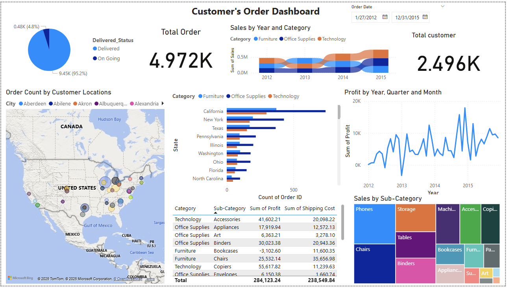
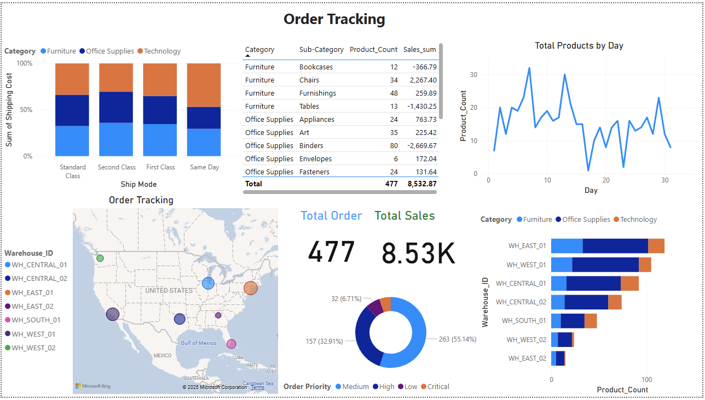

# 📌 Customer Order & Tracking Dashboard - Power BI

## 📝 Overview
This Power BI project provides insights into **customer orders and product tracking** using **interactive dashboards**. It visualizes order status, sales trends, shipping details, and warehouse assignments.

---

## 📊 Dashboards

### 1️⃣ Customer's Order Dashboard
This dashboard provides a high-level **business overview** of customer orders, sales performance, and profitability.

#### 🔹 Key Features:
- 📈 **Total Orders & Customers**  
- 📊 **Sales by Year & Category**  
- 🌎 **Order Count by State & City**  
- 💰 **Profit Trends Over Time**  
- 🔥 **Top Selling Categories & Products**  
- 🚚 **Shipping Cost & Order Priority Analysis**  

#### 📊 Visuals Used:
- **Pie Chart**: Order Delivery Status  
- **Line Chart**: Profit Trends Over Time  
- **Bar Chart**: Order Count by State  
- **Treemap**: Sales by Sub-Category  
- **Map Visualization**: Order Count by Customer Locations  

---

### 2️⃣ Order Tracking Dashboard
This dashboard focuses on **warehouse tracking**, showing where orders are stored and shipped.

#### 🔹 Key Features:
- 📦 **Order Status & Total Sales Tracking**  
- 🏭 **Warehouse Assignment & Product Count per Warehouse**  
- 📊 **Total Products Processed per Day**  
- 🚛 **Shipping Cost Breakdown by Ship Mode**  
- 🏬 **Warehouse Prioritization Based on Order Volume**  

#### 📊 Visuals Used:
- **Map Visualization**: Order Distribution Across Warehouses  
- **Stacked Bar Chart**: Product Count per Warehouse  
- **Donut Chart**: Order Priority Distribution  
- **Table View**: Products, Sales, and Shipping Costs  

---

## 📂 Data Sources
- **Order Dataset** (Customer orders, delivery status, order priority)  
- **Warehouse Locations** (Latitude & Longitude, Warehouse Assignments)  

---

## ⚡ How to Use This Dashboard
1. **Filter by Date:** Use the date slicer to view orders for specific periods.  
2. **Drill Down by Warehouse:** Click on warehouse locations to analyze order distribution.  
3. **Analyze Sales Trends:** Use interactive graphs to explore category-wise performance.  
4. **Track Orders:** View real-time order tracking based on status and priority.  

---

## 🚀 Technologies Used
- **Power BI** for data visualization  
- **DAX (Data Analysis Expressions)** for custom measures  
- **Power Query** for data transformation  

---

## 📌 Screenshots
### **Customer Order Dashboard:**

### **Order Tracking Dashboard:**

---

## 🔮 Future Enhancements
- Add **real-time tracking updates**.  
- Integrate **external API data sources** (live shipment tracking).  
- Implement **predictive analytics** for demand forecasting.  

